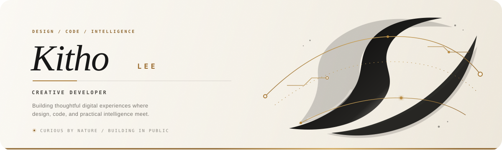

  

  
  
  

  

 

## 01 · About

I'm **Kitho Lee** — a curious developer drawn to the space where thoughtful design, modern technology, and practical intelligence meet.

I enjoy turning uncertain ideas into clear, useful digital experiences. Right now, I am building strong foundations across the modern web, exploring how AI can improve everyday tools, and documenting the process openly as I grow.

> My approach is simple: stay curious, build with intention, and let every project teach me something new.

## 02 · Currently exploring

  
  
  
  
  
  
  
  

## 03 · Signal & momentum

  <picture>
    <source media="(prefers-color-scheme: dark)" srcset="https://github-profile-summary-cards.vercel.app/api/cards/profile-details?username=Kitho-Lee&theme=github_dark" />
    <source media="(prefers-color-scheme: light)" srcset="https://github-profile-summary-cards.vercel.app/api/cards/profile-details?username=Kitho-Lee&theme=default" />
    
  </picture>

  <picture>
    <source media="(prefers-color-scheme: dark)" srcset="https://streak-stats.demolab.com?user=Kitho-Lee&hide_border=true&background=0D1117&ring=B8893E&fire=D1A759&currStreakLabel=D1A759&sideLabels=C9D1D9&dates=8B949E&currStreakNum=FFFFFF&sideNums=FFFFFF" />
    <source media="(prefers-color-scheme: light)" srcset="https://streak-stats.demolab.com?user=Kitho-Lee&hide_border=true&background=F7F3EA&ring=8C642D&fire=B8893E&currStreakLabel=8C642D&sideLabels=44413C&dates=77736D&currStreakNum=111111&sideNums=111111" />
    
  </picture>

## 04 · The roadmap

<table>
  <tr>
    <td align="center" width="33%">
      <h3>01 · Explore</h3>
      
Learn the fundamentals deeply.

    </td>
    <td align="center" width="33%">
      <h3>02 · Build</h3>
      
Turn small ideas into real products.

    </td>
    <td align="center" width="33%">
      <h3>03 · Share</h3>
      
Document the journey in public.

    </td>
  </tr>
</table>

## 05 · Build log

<table>
  <tr>
    <td width="50%" valign="top">
      <h3>✦ 01 · First project</h3>
      
The first public build is taking shape. Good things start with an empty repository.

      
<code>idea</code> <code>prototype</code> <code>ship</code>

      <strong>Coming soon →</strong>
    </td>
    <td width="50%" valign="top">
      <h3>✦ 02 · Open source</h3>
      
Learning in public and preparing to make the first meaningful contribution.

      
<code>learn</code> <code>contribute</code> <code>grow</code>

      <strong>Next up →</strong>
    </td>
  </tr>
</table>

## 06 · Current signal

- 🔭 Building a public developer journey from the ground up
- 🌱 Exploring modern web development and practical AI
- 🧩 Turning small ideas into working, shareable projects
- ⚡ Believing that consistency beats intensity

## 07 · Find me here

  

 

  
  DESIGNED WITH CURIOSITY · BUILT WITH INTENTION

