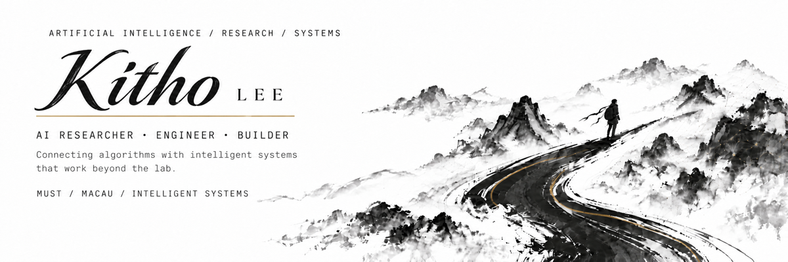

<div align="center">
  
</div>

<div align="center">
  
  
  
  <a href="https://github.com/Kitho-Lee?tab=followers">
    
  </a>
</div>

<div align="center">
  
</div>

<br />

## 01 // SYSTEM PROFILE

```text
$ whoami
  Jiehao Li / Kitho Lee

$ system.status --verbose
  affiliation : Macau University of Science and Technology
  location    : Macau
  focus       : Artificial Intelligence
  mode        : Research × Engineering × Building
  objective   : Intelligent systems that work beyond the lab
```

Hi, I'm **Jiehao Li — Kitho Lee online.**

I'm an undergraduate student at **Macau University of Science and Technology**, building intelligent systems that connect algorithms with real-world applications.

My work lives where **artificial intelligence, signal processing, optimization, and engineering systems** converge. I move between theory and implementation: understanding the structure behind data, designing learning systems around it, and turning research ideas into technology that survives outside the lab.

## 02 // RESEARCH VECTORS

| VECTOR | DOMAIN | SIGNAL |
|:--:|---|---|
| `AI.01` | **Artificial Intelligence & Machine Learning** | Robust, practical learning systems |
| `TS.02` | **Time Series & Representation Learning** | Preserving meaningful temporal structure |
| `RL.03` | **Reinforcement Learning** | Decision-making under complex dynamics |
| `NET.04` | **Intelligent Networking** | AI-native wireless access and allocation |
| `GEN.05` | **Generative AI** | Controllable, temporally coherent video |
| `AUTO.06` | **Embodied & Autonomous AI** | Perception → reasoning → physical action |

## 03 // ACTIVE MODULES

<table>
  <tr>
    <td width="50%" valign="top">
      <h3>MODULE_01 · Structure-Preserving Forecasting</h3>
      <p><code>STATUS: ACTIVE</code> · <code>TRACK: TIME SERIES</code></p>
      <p>Exploring models that preserve trends, periodicity, power spectral density, and autocorrelation — not prediction error alone.</p>
    </td>
    <td width="50%" valign="top">
      <h3>MODULE_02 · RL for Wireless Systems</h3>
      <p><code>STATUS: ACTIVE</code> · <code>TRACK: DECISION INTELLIGENCE</code></p>
      <p>Studying online and offline reinforcement learning for intelligent channel access and wireless coexistence.</p>
    </td>
  </tr>
  <tr>
    <td width="50%" valign="top">
      <h3>MODULE_03 · Generative AI for E-commerce</h3>
      <p><code>STATUS: EXPLORING</code> · <code>TRACK: VIDEO GENERATION</code></p>
      <p>Investigating temporal consistency and controllability in AI-generated product videos.</p>
    </td>
    <td width="50%" valign="top">
      <h3>MODULE_04 · Embodied & Autonomous AI</h3>
      <p><code>STATUS: EXPLORING</code> · <code>TRACK: AUTONOMOUS SYSTEMS</code></p>
      <p>Exploring systems that combine perception, reasoning, decision-making, and physical execution.</p>
    </td>
  </tr>
</table>

## 04 // TOOLCHAIN

**LANGUAGES**

<p>
  
  
  
  
</p>

**AI / MACHINE LEARNING**

<p>
  
  
  
  
  
</p>

**RESEARCH / ENGINEERING**

`ns-3` · `Optimization` · `Signal Processing` · `Computer Networks`

**CURRENTLY EXPLORING**

`MLX` · `LoRA` · `Local LLMs` · `AI Agents`

## 05 // RESEARCH PRINCIPLE

> ### `CORE_AXIOM`
>
> **Low error does not necessarily mean a model truly understands the structure of the data.**

I'm interested in AI systems that are not only accurate, but also **robust, interpretable, structurally consistent, and deployable in the real world**.

## 06 // BUILD MODE

<table>
  <tr>
    <td width="33%" align="center"><b>RESEARCH</b><br /><sub>Find the structure.</sub></td>
    <td width="33%" align="center"><b>ENGINEERING</b><br /><sub>Build the system.</sub></td>
    <td width="33%" align="center"><b>ENTREPRENEURSHIP</b><br /><sub>Create real-world value.</sub></td>
  </tr>
</table>

I enjoy turning technical ideas into practical products. The most interesting intelligent systems appear when **research meets constraints, engineering meets scale, and ideas meet people**.

```text
IDEA ──► MODEL ──► SYSTEM ──► IMPACT
```

## 07 // TELEMETRY

<div align="center">
  <picture>
    <source media="(prefers-color-scheme: dark)" srcset="https://github-profile-summary-cards.vercel.app/api/cards/profile-details?username=Kitho-Lee&theme=github_dark" />
    <source media="(prefers-color-scheme: light)" srcset="https://github-profile-summary-cards.vercel.app/api/cards/profile-details?username=Kitho-Lee&theme=github_dark" />
    
  </picture>
</div>

<div align="center">
  <picture>
    <source media="(prefers-color-scheme: dark)" srcset="https://streak-stats.demolab.com?user=Kitho-Lee&hide_border=true&background=0B1020&ring=38BDF8&fire=A78BFA&currStreakLabel=7DD3FC&sideLabels=C9D1D9&dates=64748B&currStreakNum=FFFFFF&sideNums=FFFFFF" />
    <source media="(prefers-color-scheme: light)" srcset="https://streak-stats.demolab.com?user=Kitho-Lee&hide_border=true&background=0B1020&ring=38BDF8&fire=A78BFA&currStreakLabel=7DD3FC&sideLabels=C9D1D9&dates=64748B&currStreakNum=FFFFFF&sideNums=FFFFFF" />
    
  </picture>
</div>

## 08 // LINK

<div align="center">
  <a href="https://github.com/Kitho-Lee">
    
  </a>
</div>

<br />

<div align="center">
  
  <sub><b>// BUILD THINGS · UNDERSTAND SYSTEMS · KEEP MOVING FORWARD //</b></sub>
</div>
