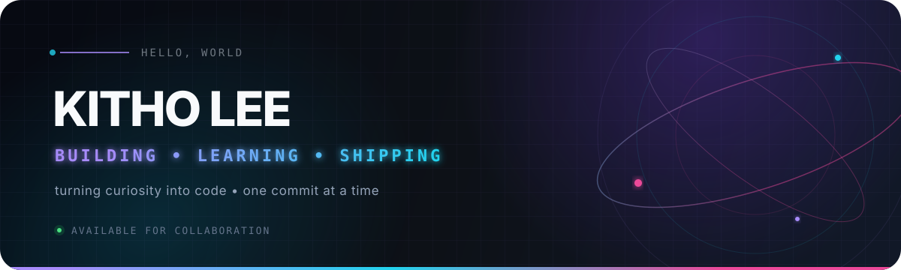

<div align="center">
  
</div>

<div align="center">
  <a href="https://github.com/Kitho-Lee?tab=followers">
    
  </a>
  
  <a href="https://github.com/Kitho-Lee">
    
  </a>
</div>

<br />

## 👾 About me

```typescript
const developer = {
  name: "Kitho Lee",
  role: "Developer in progress",
  mode: "Building · Learning · Shipping",
  interests: ["Web", "AI", "Open source"],
  currentMission: "Turn curiosity into useful things",
  motto: "One idea. One commit. Every day."
};
```

> Starting from a blank canvas and building in public — one meaningful commit at a time.

## ⚡ Currently exploring

<div align="center">
  
</div>

## 📊 Signal & momentum

<div align="center">
  <picture>
    <source media="(prefers-color-scheme: dark)" srcset="https://github-readme-stats.vercel.app/api?username=Kitho-Lee&show_icons=true&hide_border=true&bg_color=0d1117&title_color=a78bfa&icon_color=22d3ee&text_color=c9d1d9&rank_icon=github" />
    <source media="(prefers-color-scheme: light)" srcset="https://github-readme-stats.vercel.app/api?username=Kitho-Lee&show_icons=true&hide_border=true&title_color=7c3aed&icon_color=0891b2" />
    
  </picture>
  <picture>
    <source media="(prefers-color-scheme: dark)" srcset="https://github-readme-stats.vercel.app/api/top-langs/?username=Kitho-Lee&layout=compact&hide_border=true&bg_color=0d1117&title_color=a78bfa&text_color=c9d1d9&langs_count=8" />
    <source media="(prefers-color-scheme: light)" srcset="https://github-readme-stats.vercel.app/api/top-langs/?username=Kitho-Lee&layout=compact&hide_border=true&title_color=7c3aed&langs_count=8" />
    
  </picture>
</div>

<div align="center">
  <picture>
    <source media="(prefers-color-scheme: dark)" srcset="https://streak-stats.demolab.com?user=Kitho-Lee&hide_border=true&background=0D1117&ring=A78BFA&fire=EC4899&currStreakLabel=22D3EE&sideLabels=C9D1D9&dates=8B949E&currStreakNum=FFFFFF&sideNums=FFFFFF" />
    <source media="(prefers-color-scheme: light)" srcset="https://streak-stats.demolab.com?user=Kitho-Lee&hide_border=true&ring=7C3AED&fire=DB2777&currStreakLabel=0891B2" />
    
  </picture>
</div>

## 🚀 Build log

<table>
  <tr>
    <td width="50%" valign="top">
      <h3>✦ 01 · First project</h3>
      <p>The first public build is taking shape. Good things start with an empty repository.</p>
      <p><code>idea</code> <code>prototype</code> <code>ship</code></p>
      <strong>Coming soon →</strong>
    </td>
    <td width="50%" valign="top">
      <h3>✦ 02 · Open source</h3>
      <p>Learning in public and preparing to make the first meaningful contribution.</p>
      <p><code>learn</code> <code>contribute</code> <code>grow</code></p>
      <strong>Next up →</strong>
    </td>
  </tr>
</table>

## 🛰️ Current signal

- 🔭 Building a public developer journey from the ground up
- 🌱 Exploring modern web development and practical AI
- 🧩 Turning small ideas into working, shareable projects
- ⚡ Believing that consistency beats intensity

## 🤝 Find me here

<div align="center">
  <a href="https://github.com/Kitho-Lee">
    
  </a>
</div>

<br />

<div align="center">
  
  <sub>Designed with curiosity, built with intention.</sub>
</div>
